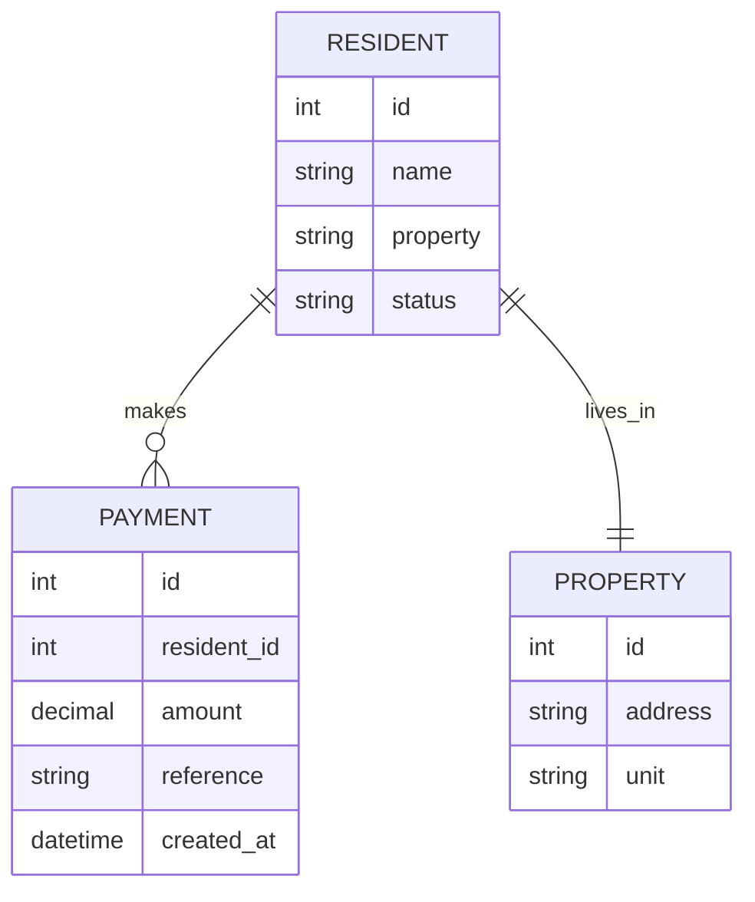
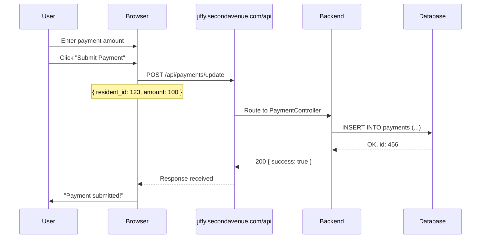

# 🚀 DISCOVERY FLOW - ACTION PLAN

## Current Status: 63% Complete (Phase 2 of 4)

You have the **foundation**. Now let's build the **map**.

---

## 🎯 IMMEDIATE WINS (Today/Tomorrow)

### Action 1: Enhance JS Logger for Response Capture
**Time:** 30 min | **Impact:** High | **Complexity:** Low

**Problem:** Currently capturing requests only; missing response bodies.

**Solution:** Update `scripts/utils.py` to capture full request/response pairs.

**File to modify:** `scripts/utils.py` → `get_fetch_logger_script()`

**Code change:**
```python
# OLD: Captures request only
window.fetch = function(...args) {
  window.__capturedFetches.push({ url, method, body });
  return originalFetch(...args);
}

# NEW: Captures request + response
window.fetch = function(...args) {
  return originalFetch(...args).then(response => {
    response.clone().json().then(json => {
      window.__capturedFetches.push({ 
        url, method, body,      // request
        status, response: json   // ✅ response data
      });
    });
    return response;
  });
}
```

**Verification:**
```python
# After running automation, check logs:
# [CAPTURED_FETCH] POST /api/payments/update
#   Request: { resident_id: 123, amount: 100 }
#   Response: { success: true, id: "pay_456" }  ✅ Now visible
```

---

### Action 2: Extract API Reference from Logs
**Time:** 45 min | **Impact:** High | **Complexity:** Medium

**Problem:** API endpoints are discovered but not documented.

**Solution:** Parse logs → generate `docs/API_REFERENCE.md`

**Files to create:**
- `scripts/api_reference_generator.py` (new utility)
- `docs/API_REFERENCE.md` (generated)

**Script logic:**
```python
# scripts/api_reference_generator.py

def parse_logs_for_apis(log_file_path):
    """Extract all API calls from log file."""
    apis = {}
    for line in open(log_file_path):
        if 'CAPTURED_FETCH' in line:
            # Parse: [CAPTURED_FETCH] POST /api/payments/update
            endpoint = extract_endpoint(line)
            if endpoint not in apis:
                apis[endpoint] = {
                    'method': 'POST',
                    'url': endpoint,
                    'calls': 0,
                    'samples': []
                }
            apis[endpoint]['calls'] += 1
            apis[endpoint]['samples'].append(parse_request_response(line))
    return apis

def generate_reference(apis):
    """Create markdown documentation."""
    md = "# API Reference\n\n"
    for endpoint, data in apis.items():
        md += f"## {data['method']} {endpoint}\n"
        md += f"- **Calls made:** {data['calls']}\n"
        md += f"- **Sample request:** {json.dumps(data['samples'][0]['request'])}\n"
        md += f"- **Sample response:** {json.dumps(data['samples'][0]['response'])}\n"
    return md
```

**How to run:**
```powershell
# 1. First, run automation to generate logs
python -m scripts.main --dry-run
# This creates: logs/dry_run_2025-11-27T10_00_00.log

# 2. Generate API reference
python -m scripts.api_reference_generator --log-file logs/dry_run_2025-11-27T10_00_00.log --output docs/API_REFERENCE.md

# 3. Result: docs/API_REFERENCE.md with all discovered endpoints
```

---

### Action 3: Create Data Model Diagram
**Time:** 1 hour | **Impact:** Medium | **Complexity:** Medium

**Problem:** Data relationships are unclear.

**Solution:** Create ER diagram in Mermaid format.

**Files to create:**
- `docs/DATA_MODEL.md` (Mermaid ER diagram)

**Diagram (inferred from API calls):**


**How to create:**
```powershell
# 1. Open docs/DATA_MODEL.md in VS Code
# 2. Use Markdown Mermaid extension (install: "Markdown Preview Mermaid Support")
# 3. Paste ER diagram code above
# 4. Preview (Ctrl+Shift+V)
# 5. Commit to repo

# Infer entities from:
# - API endpoints (/api/residents, /api/payments, /api/properties)
# - Response data structure (JSON response shape)
# - Database column names (from API responses)
```

---

## 📋 THIS WEEK (Completing Phase 3)

### Action 4: Create Workflow Sequence Diagrams
**Time:** 2 hours | **Impact:** Medium | **Complexity:** Medium

**Problem:** "What happens when I click Submit Payment?"

**Solution:** Document workflow as sequence diagrams.

**Files to create:**
- `docs/WORKFLOWS.md` (Mermaid sequences)

**Example:**


**How to create:**
```
1. Run automation with debugging enabled
2. Trace the steps taken
3. Create sequence for each major workflow
4. Add to docs/WORKFLOWS.md
5. Verify by comparing with actual log output
```

---

### Action 5: Enhanced Error Testing
**Time:** 1.5 hours | **Impact:** Medium | **Complexity:** Medium

**Problem:** Don't know how system behaves on errors.

**Solution:** Create edge case test suite.

**Files to create:**
- `tests/test_edge_cases.py` (new)

**Test scenarios:**
```python
def test_duplicate_payment():
    # What if we submit the same payment twice?
    record1 = {'resident_id': 123, 'amount': 100}
    record2 = {'resident_id': 123, 'amount': 100}
    
    result1 = api.update_payment(record1)
    result2 = api.update_payment(record2)
    
    # Expected: second payment either rejected or handled gracefully

def test_invalid_resident():
    # What if resident doesn't exist?
    record = {'resident_id': 999999, 'amount': 100}
    result = api.update_payment(record)
    # Expected: 404 or error response

def test_negative_amount():
    # What if amount is negative?
    record = {'resident_id': 123, 'amount': -100}
    result = api.update_payment(record)
    # Expected: validation error
```

---

## 🎯 NEXT MONTH (Completing Phase 4)

### Action 6: Request Vendor Documentation
**Time:** 15 min | **Impact:** High | **Complexity:** Low

**Problem:** Some gaps can't be discovered automatically.

**Solution:** Email jiffy admin with structured request.

**Email template:**
```
Subject: API Integration Request - Documentation

Hi [Admin],

We're integrating with your jiffy.secondavenue.com platform. To ensure a robust integration, could you provide:

1. API Documentation
   - Complete endpoint reference
   - Authentication process (token generation/refresh)
   - Rate limits and throttling info

2. Data Specifications
   - Supported fields for residents/payments
   - Data validation rules
   - Error response formats

3. Operational Details
   - Webhook support (if available)
   - Supported data formats (JSON, XML?)
   - Supported currencies/amounts

4. Support
   - How to report issues
   - Support contact info
   - SLA information

Thank you!
```

---

### Action 7: Create Production Runbook
**Time:** 1 hour | **Impact:** High | **Complexity:** Low

**Problem:** "How do we run this in production?"

**Solution:** Create `docs/PRODUCTION_RUNBOOK.md`

**Sections:**
```
1. Pre-flight Checklist
   - API credentials set?
   - Input file prepared?
   - Logs directory writable?

2. Running the Automation
   - Command to run
   - Expected output
   - How long it takes

3. Monitoring
   - Where to find logs
   - What to look for
   - Alert thresholds

4. Troubleshooting
   - Common errors
   - How to fix them
   - Who to contact

5. Rollback Procedure
   - How to undo changes
   - Emergency contacts
```

---

### Action 8: Create Deployment Guide
**Time:** 1.5 hours | **Impact:** Medium | **Complexity:** Medium

**Problem:** "How do we deploy this?"

**Solution:** Create `docs/DEPLOYMENT.md`

**Sections:**
```
1. Windows Task Scheduler Setup
   - Step-by-step screenshots
   - Trigger configuration
   - Action configuration
   - Notification setup

2. Environment Setup
   - Python installation
   - Virtual environment
   - Dependencies

3. Configuration
   - Where to put credentials
   - Config file locations
   - Environment variables

4. Testing Deployment
   - How to verify it works
   - Test run procedure
   - Validation checklist

5. Troubleshooting Deployment
   - Common issues
   - Solutions
```

---

## 📊 COMPLETION TIMELINE

| Week | Actions | Phase | Completion |
|------|---------|-------|-----------|
| **This Week** | 1-3 | Phase 2 → Phase 3 | 63% → 75% |
| **Week 2** | 4-5 | Phase 3 | 75% → 85% |
| **Week 3-4** | 6-8 | Phase 4 | 85% → 100% |

---

## ✨ SUCCESS CRITERIA

After completing all actions, you'll have:

- ✅ Full API discovery + documentation
- ✅ Data model diagram
- ✅ Workflow sequence diagrams
- ✅ Edge case coverage
- ✅ Production runbook
- ✅ Deployment guide
- ✅ Vendor documentation

**Result:** Any engineer can take over this project in 1 hour.

---

## 🏃 START HERE (Right Now)

```powershell
# 1. Backup current work
git add -A
git commit -m "Pre-discovery-enhancement checkpoint"

# 2. Update JS logger (Action 1)
# - Edit scripts/utils.py
# - Replace fetch logger script
# - Test by running: python -m scripts.main --dry-run

# 3. Check logs for new response data
Get-Content logs/dry_run_*.log | Select-String "CAPTURED_FETCH"

# 4. Next: Create API reference generator (Action 2)
```

---

## 📞 Questions?

Each action includes:
- Clear problem statement
- Specific solution
- Code examples
- Verification steps
- Time estimate

Pick any action above and we'll implement it. Recommend starting with **Actions 1-3** this week.

🎯 **Goal:** Complete Phase 3 (Connection Mapping) by end of week.
